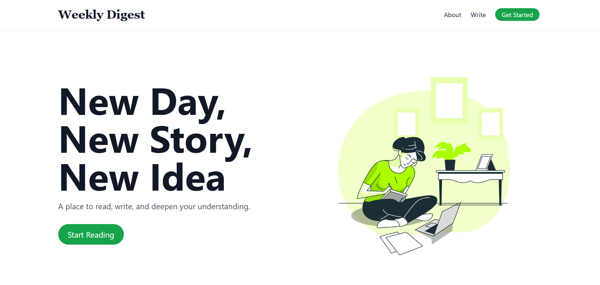
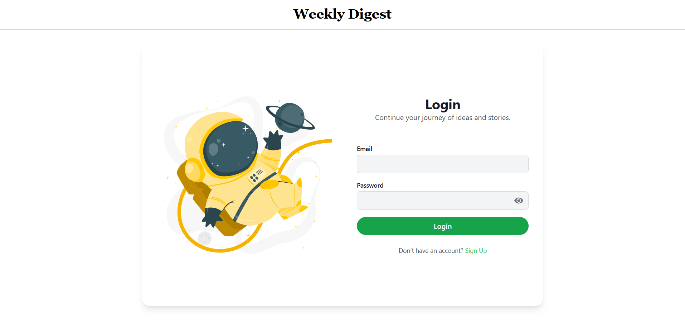
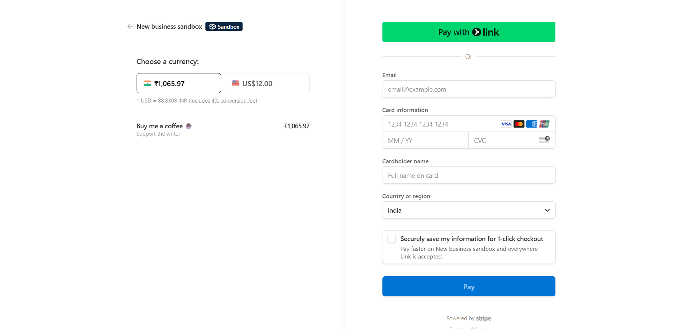

#WeeklyDigest 
A modern and responsive full-stack blogging platform where users can read, write and explore stories, ideas and daily lifestyle. 
Built using React, Redux, TailwindCss, framer-motion on the frontend with backend support for auth, crud blog, and payments.

✨Features
1️⃣ User Authentication: Register/Login/LogOut
2️⃣ Blog Creation, Updation, Deletion
3️⃣ Blog Viewer
4️⃣ Redux Store to manage global state management
5️⃣ Payment Integration: Built-in payment component
6️⃣ Responsive sleek design
7️⃣ Pagination for better view
8️⃣ Dynamic Routing
9️⃣ Category Tags
🔟 Fallback Images

📁 Frontend 
☀️ React
☀️ Redux + Redux Toolkit
☀️ React Router DOM
☀️ TailwindCSS
☀️ Moment.js
☀️ React Icons
☀️ Custom Hooks

📁 Backend
☀️ Express
☀️ JWT
☀️ Bcrypt
☀️ MongoDB
☀️ Stripe

#ScreenShots

💼 Installation

#Run Locally!!! 

#Clone the repo:
git clone https://github.com/Aryan1711-rookie/WeeklyDigest.git

#frontend(weeklyDigest)
cd weeklyDigest
npm run dev

#backend
cd backend
nodemon server.js or node server.js

Visit to check the platform live:
https://weeklydigest-blog.onrender.com/

